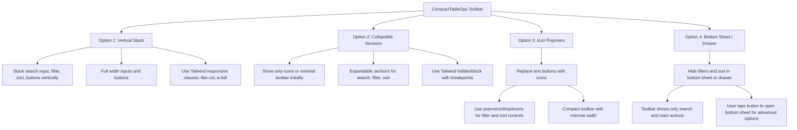

# Mobile Layout Plan for CompactTableOps Component

This document outlines several possible mobile layout options for the `CompactTableOps` component, which currently is not suitable for mobile view. The component is a toolbar with search, filter, sort, and action buttons.

## Overview

The current layout is a horizontal toolbar with multiple buttons and inputs. On mobile devices, horizontal space is limited, so the layout needs to be adapted for usability and accessibility.

## Mobile Layout Options

### 1. Vertical Stack Layout

-   Stack all toolbar elements vertically.
-   Inputs and buttons take full width.
-   Simple and straightforward.
-   Use Tailwind classes like `flex-col`, `w-full`, `space-y-2`.
-   **Pros:** Easy to implement, good for narrow screens.
-   **Cons:** Takes more vertical space.

### 2. Collapsible Sections

-   Show minimal toolbar with icons or summary badges.
-   Expandable/collapsible sections for search, filter, and sort.
-   Saves vertical space by hiding controls until needed.
-   Use Tailwind `hidden`, `block`, and state toggles.
-   **Pros:** Compact, user controls visibility.
-   **Cons:** More interaction required.

### 3. Icon Popovers

-   Replace text buttons with icons.
-   Use popovers or dropdown menus for filter and sort controls.
-   Toolbar remains horizontal but compact.
-   **Pros:** Saves space, familiar UI pattern.
-   **Cons:** May be less discoverable for some users.

### 4. Bottom Sheet / Drawer

-   Keep toolbar minimal with search and main actions.
-   Move filters and sort controls to a bottom sheet or drawer.
-   User opens sheet/drawer to access advanced controls.
-   **Pros:** Clean main UI, advanced controls accessible.
-   **Cons:** Requires additional UI components.

## Visual Diagram

---

This plan provides a clear set of options to improve the mobile usability of the `CompactTableOps` component using Tailwind CSS.

You can refer to this document for implementation or further discussion.
